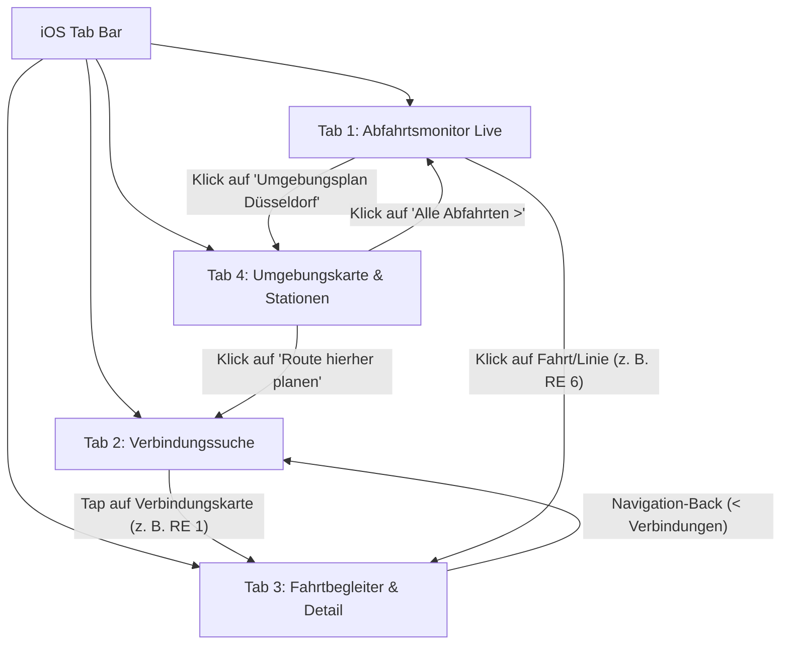

# FlowNRW – App-Flow & Screen-Interaktionsdokumentation

## 1. Übersicht der Kern-Screens & Navigationshierarchie

Die App basiert auf einer persistenten **iOS Tab-Bar** (Human Interface Guidelines) mit 4 Hauptmodi, ergänzt durch kontextuelle Drill-Downs und Querverbindungen.

| Tab | Screen-Titel | Zweck & Hauptfunktion | Zugehöriger Screen |
| :--- | :--- | :--- | :--- |
| **1** | **Abfahrten** | Echtzeit-Abfahrtsmonitore sortiert nach GPS-Distanz, Linienfilter, Verspätungen/Ausfälle | `Abfahrtsmonitor Live` |
| **2** | **Verbindungen** | Bundesweite & NRW-Routenplanung (Start/Ziel), Kriterienfilter, Alternativrouten | `Verbindungssuche` |
| **3** | **Fahrtbegleiter** | Aktive Reisebegleitung, Haltestellen-Timeline mit GPS-Sync, Wagenreihung, Umstiegsalarm | `Fahrtbegleiter & Detail` |
| **4** | **Haltestellen** | Kartendarstellung (Apple Maps Style), POI-Ausstattung, Live-Abfahrten im Bottom Sheet | `Umgebungskarte & Stationen` |

---

## 2. Navigationsarchitektur



---

## 3. Detaillierte User Flows

### Flow A: Verbindung suchen und Reise aktiv begleiten (Tab 2 → Tab 3)
1. **Startpunkt:** `Verbindungssuche`
   - Nutzer gibt Start (z. B. via GPS: *Düsseldorf, Berliner Allee*) und Ziel (*Köln Hbf*) ein.
   - Filterauswahl: Verkehrsmittel (*ICE/IC, Nahverkehr, S-Bahn*) sowie Optionen (*Fahrrad*).
   - Klick auf **„Verbindungen suchen“**.
2. **Ergebnisliste & Auswahl:**
   - Übersicht der Fahrtoptionen mit Fahrzeit, Umstiegen, Pünktlichkeitsstatus und Deutschlandticket-Gültigkeit.
   - Nutzer tippt auf die Option **RE 1 RRX (14:38 → 15:08)**.
3. **Übergang:**
   - Die App navigiert in den Screen `Fahrtbegleiter & Detail` (Push Navigation).
4. **Interaktion im Fahrtbegleiter:**
   - Visualisierung der Stationen-Timeline mit Live-Fortschritt (GPS-Tracking: *Düsseldorf Hbf [Abgefahren]* → *Düsseldorf-Benrath [Aktueller Halt]* → *Köln Hbf*).
   - Live-Störungshinweise (Echtzeit-Hinweis NRW bezüglich Güterzug/Pünktlichkeit).
   - Aktivierung des **Umstiegs-Alarms** (Push/Vibration 5 Min vor Ausstieg/Gleiswechsel).
5. **Rückweg:**
   - Tipp auf den Back-Button `< Verbindungen` führt zurück zur vorherigen Ergebnisliste mit erhaltener Sucheingabe.

---

### Flow B: Haltestelle auf Karte erkunden und Route starten (Tab 4 → Tab 2)
1. **Startpunkt:** `Umgebungskarte & Stationen`
   - Die Karte zentriert sich auf den GPS-Standort und zeigt Stationen im Umkreis (*Heinrich-Heine-Allee, Schadowstraße, Hbf*).
2. **Stationsauswahl:**
   - Tipp auf einen Pin oder Auswahl in der Suche öffnet das native iOS Bottom Sheet für *Düsseldorf Heinrich-Heine-Allee*.
   - Einsicht der Haltestellen-Features (Aufzüge stufenfrei, DB Automat, Nextbike Verfügbarkeit).
   - Schnelleinsicht der nächsten 3 Abfahrten (U 72, U 75, U 76).
3. **Aktion:**
   - Klick auf den prominenten Button **„Route hierher planen“**.
4. **Übergang:**
   - Die App wechselt direkt auf Tab 2 (`Verbindungssuche`).
   - Die ausgewählte Station wird automatisch als **Ziel** eingetragen; als **Start** wird der aktuelle GPS-Standort vorausgewählt.

---

### Flow C: Abfahrtsmonitor zur Karten-Verortung (Tab 1 → Tab 4)
1. **Startpunkt:** `Abfahrtsmonitor Live`
   - Schnelle Übersicht der nächsten Züge und Bahnen ab *Düsseldorf Hbf* und naheliegenden Haltestellen (*D-Worringer Platz*).
2. **Aktion:**
   - Nutzer scrollt nach unten und tippt auf das Widget **„Umgebungsplan Düsseldorf – Live-Fahrzeuge & Bahnhofszugänge anzeigen“** oder auf eine Haltestellenüberschrift.
3. **Übergang:**
   - Wechsel zu `Umgebungskarte & Stationen` mit Fokussierung auf die Station, um Ein- und Ausgänge, Fußwege sowie Umsteigeebenen optisch nachzuvollziehen.

---

### Flow D: Von der Station zum vollen Live-Monitor (Tab 4 → Tab 1)
1. **Startpunkt:** `Umgebungskarte & Stationen`
   - Nutzer betrachtet das Bottom Sheet einer Haltestelle.
2. **Aktion:**
   - Neben den 3 Schnellabfahrten tippt der Nutzer auf **„Alle Abfahrten ›“**.
3. **Übergang:**
   - Wechsel auf Tab 1 (`Abfahrtsmonitor Live`), vorgefiltert auf die gewählte Station mit vollständiger Linienfilterung (Bahn & S, U & Tram, Bus) und Echtzeit-Soll/Ist-Vergleich.

---

## 4. MVVM-Datenfluss & State Management (.NET MAUI / C#)

```
[ APIs & Services ]
       │
       ├─► LocationService (GPS / Geofence) ──► Tab 1 & Tab 4
       ├─► RealtimeEfaService (NRW EFA/TRIAS) ──► Shared Realtime Bus (SignalR / Polling)
       └─► NationalRoutingService (HAFAS/OpenData) ──► Tab 2
                                                             │
                                                  JourneySelectedEvent
                                                             ▼
                                                    TripCompanionViewModel (Tab 3)
```

1. **Shared State:**
   - **`CurrentLocation`**: Ermittelt durch `ILocationService`, steuert die Sortierung im `DeparturesViewModel` (Tab 1) und die Kartenansicht im `MapViewModel` (Tab 4).
   - **`SelectedJourney`**: Wird beim Klick in `TripSearchViewModel` (Tab 2) an `TripCompanionViewModel` (Tab 3) übergeben.
   - **`FavoritesRepository`**: Synchronisiert gespeicherte Haltestellen zwischen Tab 1 (Favoriten-Dashboard) und Tab 4 (Herz/Favoriten-Button im Bottom Sheet).
2. **Echtzeit-Synchronisation:**
   - Push/Polling im Hintergrund aktualisiert Verspätungen und Gleiswechsel alle 15–30 Sekunden simultan in Monitor, Verbindungssuche und Fahrtbegleiter.
