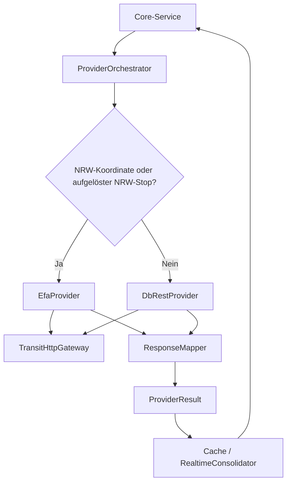

# Fahrplanauskunft — Architektur

## Beteiligte Komponenten

| Komponente | Typ | Rolle |
|------------|-----|-------|
| `StopSearchService` | Core-Service | Validiert Such-/Koordinatenanfragen und delegiert Suche/Nähe. |
| `RoutingService` | Core-Service | Validiert Orte, fordert kommende Verbindungen an und filtert alte Ergebnisse. |
| `DepartureService` | Core-Service | Fordert Abfahrten für einen normalisierten Stop an. |
| `ProviderOrchestrator` | Core-Service | Dedupliziert Anfragen, wählt regional/national, konsolidiert und aktiviert Rückfälle. |
| `DbRestProvider` | Adapter | Bundesweiter JSON-Gateway. |
| `EfaProvider` | Adapter | VRR-EFA-RapidJSON-Gateway und konfigurierbarer Entwicklungsfallback. |
| `TransitHttpGateway` | Infrastruktur | HTTPS, Timeout, Cancellation, Retry, Antwortlimit und Diagnose. |
| `MemoryTransitCache` | Infrastruktur | Begrenzter flüchtiger Cache ohne Anfragehistorie. |
| `NrwRegionClassifier` | Fachlogik | Point-in-Polygon-Klassifikation mit amtlichem NRW-MultiPolygon. |
| `RealtimeConsolidator` | Fachlogik | Konservative Stop-/Fahrtzuordnung und Soll-/Ist-Ergänzung. |

## Datenfluss

`MauiProgram.CreateMauiApp` registriert Optionen, Gateway, Adapter, Mapper, Cache, Klassifikator, Orchestrator und fachliche Services per Dependency Injection. Der Schritt bleibt ohne neue UI-Komponente; spätere Views greifen auf die Contracts zu.

## Provider erweitern und spätere Funktionen anschließen

Ein Ersatzprovider wird als `ITransitProvider`-Implementierung mit den vier vorhandenen Operationen `SearchAsync`, `NearbyAsync`, `RouteAsync` und `DeparturesAsync` ergänzt. Dafür muss die DI-Factory in `MauiProgram.CreateMauiApp` den bisherigen `national`-Provider im Konstruktor von `ProviderOrchestrator` ersetzen; eine automatische Providerentdeckung findet nicht statt. Ein zusätzlicher Verbund erfordert dagegen eine Erweiterung der Auswahl-, Regions- und Fallbacklogik sowie des `ProviderOrchestrator`-Konstruktors bzw. seiner DI-Factory und passende deterministische Tests. Die Implementierung erhält einen eigenen Mapper; Providername, Quelle, Warnungen und Datenalter müssen im `ProviderResult<T>` erhalten bleiben.

Spätere Sharing- oder Push-Funktionen schließen an den fachlichen Ergebnissen und der Providergrenze an. Dafür sind derzeit keine Produktansichten oder Zustellmechanismen implementiert; eine spätere Erweiterung kann `Journey`, `StopEvent`, `RealtimeStatus`, `ITransitProvider` und die DI-Komposition verwenden, ohne die aktuelle Datenversorgung als Sharing-/Push-Funktion auszugeben.

## Zuverlässigkeit und Datenschutz

Anfragen sind asynchron und abbrechbar. Identische laufende Anfragen werden geteilt; wenn kein wartender Aufrufer verbleibt, wird der Vorgang abgebrochen. Der Cache ist auf 256 Einträge begrenzt. Stale-Echtzeit darf höchstens fünf Minuten alt sein und wird gekennzeichnet. Diagnose enthält nur Provider, Dauer, Status, Anzahl und technische Codes; Suchtexte, Adressen, Standorte, Antwortinhalte und Geheimnisse werden nicht gespeichert.
